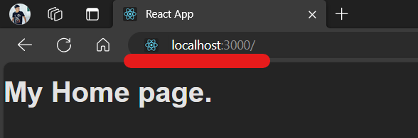
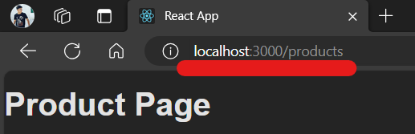

# Installation Steps

Follow these steps to install the project:

1. Clone the repository to your local machine.
2. Navigate to the project directory.
3. Install the necessary dependencies using npm:

    ```bash
    npm install
    ```

4. Install `react-router-dom` for routing in the application:

    ```bash
    npm install react-router-dom
    ```

5. Now, you are ready to run the project in your local environment using below command:

    ```bash
    npm start
    ```

# Routing in the Application

In our application, we use the `react-router-dom` library for routing. This library allows us to define multiple routes for our application and render different components based on the current URL.

## Defining a Router

In our `App.js` file, we define a router using the `createBrowserRouter` function from `react-router-dom`. This function takes an array of objects, where each object represents a route. Each object has a `path` property, which is the URL path for the route, and an `element` property, which is the React component to render when the route is matched.

Here is an example of how we define a router:

```javascript
import { createBrowserRouter, RouterProvider } from "react-router-dom";
import HomePage from "./pages/Home";
import ProductsPage from "./pages/Product.js";

const router = createBrowserRouter([
  {path: "/", element: <HomePage />},
  {path:"/products", element: <ProductsPage />},
])
```
In this example, we define a route for the root URL ("/") that renders the HomePage component.


## Using the Router
To use the router, we wrap our application in a RouterProvider component and pass the router as a prop:

```javascript
function App() {
  return <RouterProvider router={router} />;
}
```
With this setup, our application will render the HomePage component when the URL is the root URL ("/").

### Output



# Navigation in the Application

In our application, we use the `Link` component from `react-router-dom` to create navigable links.

Here is an example from our `Home.js` file:

```javascript
import { Link } from "react-router-dom";

export default function Home() {
    return <>
    <h1>My Home page.</h1>
    <p>Go to products page. <Link to="/products">Products...</Link></p>
    </>;
}
```
In this example, we have a link that navigates to the "/products" URL when clicked. The Link component uses the to prop to determine the URL to navigate to. In this case, we set to="/products" to navigate to the products page.

The text between the opening and closing Link tags ("Products...") is the text that will be displayed for the link.